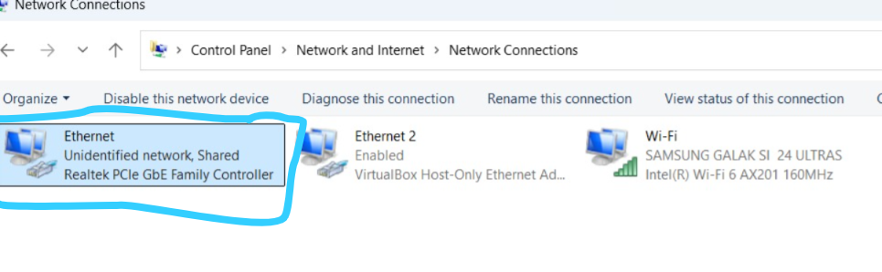
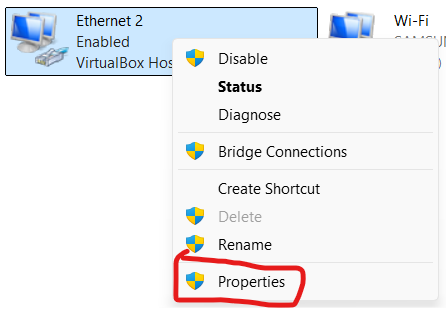
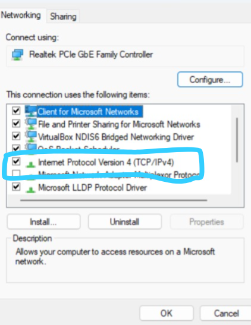
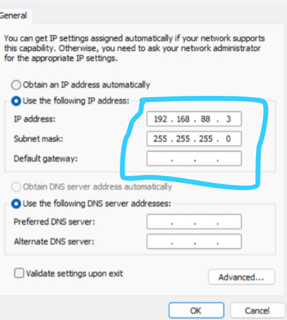
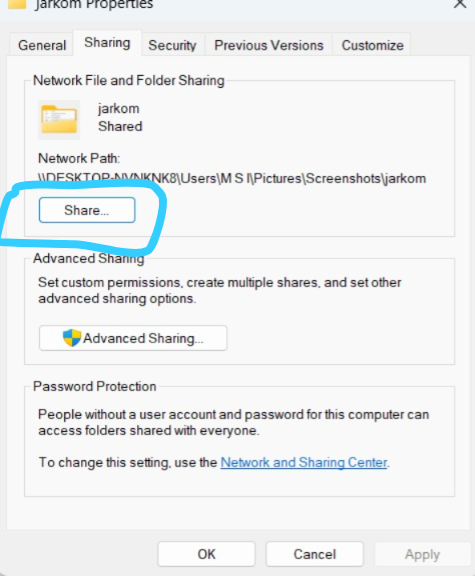
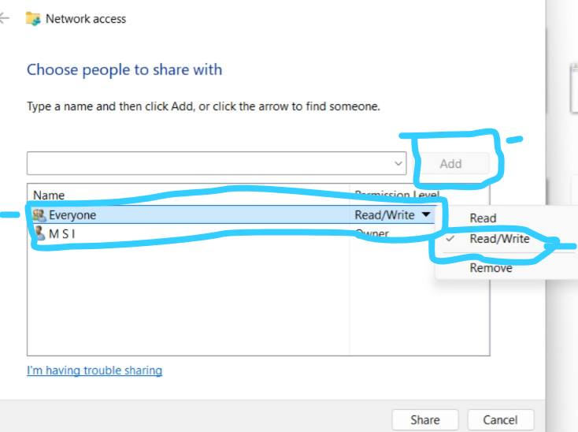

# Laporan Praktikum Jaringan Komputer 2

Hari ini tanggal 31 januari 2025, saya akan membuat laporan jaringan komputer mengenai, bagaimana cara sharing file/menghubungkan dari laptop A ke Laptop B, menggunakan kabe lan sebagai penghubung antar laptop.

# BerIkut langkah-langkah cara menghubungkan dua laptop yang memiliki sistem Operasi Windows dengan menggunakan kabel lan sebagai penghubung:

- Langkah 1: hubungkan dua laptop menggunakan kabel ethernet ( LAN ).
- Langkah 2: pergi ke Panel Kontrol->Jaringan dan Internet->Jaringan dan Pusat Berbagi

  
- Langkah 3: Klik opsi Ubah Pengaturan Adaptor di sisi kiri atas jendela. 
- Langkah 4: Pilih koneksi Wi-Fi dan koneksi Ethernet, lalu klik kanan koneksi Wi-Fi.

  
  
- Langkah 5: Pilih Properties > pilih internet protocol 4

   

- Langkah 6: Ubah IP address di laptop A menjadi 192.168.88.5 dan laptop B 192.168.88.3

  
- Langkah 7: Bukak CMD DI Laptop A > Ketikan Ping 192.168.88.3
  
  
- Langkah 8: selanjutnyaa pergi file explorer > pilih folder yang ingin di berbagi ke laptop B

  
- Langkah 9: Klik kanan pada folder > piih propertiess > pilih sharing

  
- Langkah 10: akan muncul tampilan seperti ini > pilih add > klik everyone > klik read/write.

  
- Langkah 11: 
